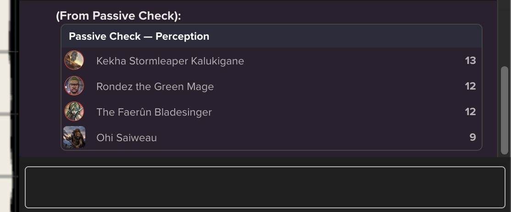
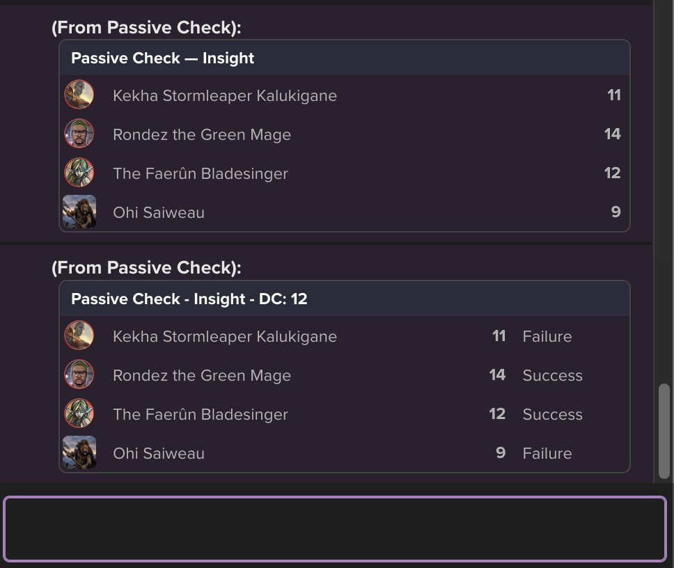

# roll20scripts

A collection of Roll20 API (Mod) scripts for game management. Paste the contents of a file into a new script in your game's **Mod (API) Scripts** page and save. All commands are chat commands; some operate on the currently selected token(s), others on the party.

> **Note:** API scripts require a Roll20 subscription tier that includes API access (Pro, or a game owned by a Pro user).

## Scripts at a glance

| Script | Command | Depends on |
|---|---|---|
| [chatCards.js](#chatcardsjs--chatcards) | *(library — no commands)* | — |
| [conditions.js](#conditionsjs--cond) | `!cond` | — |
| [hp.js](#hpjs--hp) | `!hp` | — |
| [partyman.js](#partymanjs--pm) | `!pm` | `chatCards.js` |
| [passiveCheck.js](#passivecheckjs--pcheck) | `!pcheck` | `chatCards.js`, `partyman.js` |
| [statRoller.js](#statrollerjs--rollstats) | `!rollstats` | — |
| [whimsy.js](#whimsyjs--whimsy) | `!whimsy` | — |

Roll20 evaluates every script into one shared sandbox namespace, so the shared code is organized into IIFE namespaces (`ChatCards`, `PartyMan`, `PassiveCheck`) that each expose a single global and keep their helpers private. Cross-namespace references happen inside function bodies, at call time — so **script load order does not matter**.

---

## chatCards.js — `ChatCards`

A dependency-free library for the styled chat cards the other scripts share: a title bar over a table of rows. It has no chat commands of its own — install it because something else needs it, or to build your own output on it.

Keeping the styling in one theme object means every tool built on it stays visually consistent, and a palette change lands everywhere at once.

### `ChatCards.THEME`

| Key | Applies to |
|---|---|
| `card` | The outer card container |
| `header` | The title bar |
| `table` | The row table |
| `cell` | A default cell |
| `cellNum` | A right-aligned bold cell (scores, totals) |
| `avatarCell` | The narrow cell holding an avatar |
| `avatar` | The avatar `` itself |
| `muted` | De-emphasized footnote text |
| `button` | Chat buttons (`<a>` styled as a button) |

Scripts building on ChatCards should speak in THEME keys rather than literal style strings.

### `ChatCards.Card`

| Member | What it does |
|---|---|
| `new ChatCards.Card(title, [theme])` | Starts a card; pass a theme object to override the shared `THEME` |
| `.addRow(...cells)` | Appends a row — chainable |
| `ChatCards.Card.num(value)` | *(static)* Wraps a value as a right-aligned bold cell |
| `.render()` | Returns the card's HTML |
| `.whisperGM([from])` | Whispers the rendered card to the GM |
| `.send([from])` | Sends the rendered card to public chat |

A cell is either a plain value (rendered with `THEME.cell`) or an object `{ content, style }`, where `style` is a THEME key such as `'cellNum'` or a raw CSS string.

### Example

```js
const card = new ChatCards.Card("Treasure Split")
card.addRow("Ohi Saiweau", ChatCards.Card.num("120 gp"))
    .addRow("Rondez the Green Mage", ChatCards.Card.num("120 gp"))
card.whisperGM("PartyFund")
```

---

## conditions.js — `!cond`

A CondSync-safe condition handler that adds or removes status markers on selected tokens without clobbering markers set by other means.

### Usage

Select one or more tokens, then:

| Command | Effect |
|---|---|
| `!cond +<marker>` | Add a status marker to the selected token(s) |
| `!cond -<marker>` | Remove a status marker from the selected token(s) |
| `!cond clear` | Remove **all** status markers from the selected token(s) |

`<marker>` is the marker's internal name (e.g. `sheet-blinded`, `red`, `dead`). Adding a marker that's already present is a no-op, as is removing one that isn't there. Feedback for errors (no tokens selected) is whispered to the GM.

### Examples

```
!cond +sheet-blinded
!cond -sheet-blinded
!cond clear
```

### Suggested macros

Create token-action macros for the conditions you use most:

```
Blind:      !cond +sheet-blinded
Unblind:    !cond -sheet-blinded
ClearCond:  !cond clear
```

This example uses the D&D 2024 sheet's marker set:

```
!cond ?{Condition|Blinded,+sheet-blinded|Charmed,+sheet-charmed|Deafened,+sheet-deafened|Exhausted,+sheet-exhausted|Frightened,+sheet-frightened|Grappled,+sheet-grappled|Incapacitated,+sheet-incapacitated|Invisible,+sheet-invisible|Paralyzed,+sheet-paralyzed|Petrified,+sheet-petrified|Poisoned,+sheet-poisoned|Prone,+sheet-prone|Restrained,+sheet-restrained|Stunned,+sheet-stunned|Unconscious,+sheet-unconscious|— CLEAR ALL —,clear}
```

---

## hp.js — `!hp`

A minimal, promise-based HP writer for **D&D 2024 sheets**. Writes to the character sheet's `hp` attribute via `getSheetItem` / `setSheetItem`, so it works with the modern sheetworker-backed sheets rather than raw token bars.

### Usage

Select one or more tokens (each must represent a character), then:

| Command | Effect |
|---|---|
| `!hp +7` | Heal 7 (relative change) |
| `!hp -5` | Damage 5 (relative change) |
| `!hp 25` | Set HP to exactly 25 (absolute) |

Results (or failures) are whispered to the GM per token, e.g. `Goblin: hp → 18`.

### Examples

```
!hp -?{Damage|1}
!hp +?{Healing|1}
!hp ?{Set HP to|10}
```

### Suggested macros

Token-action macros for quick combat bookkeeping:

```
Damage:  !hp -?{Amount}
Heal:    !hp +?{Amount}
SetHP:   !hp ?{New HP}
```

### Planned / TODO

- Consume temp HP (bar2) before applying damage to the real pool
- Keep token bars in sync
- Clamp to 0
- Whisper early-return reasons for better error visibility
- Targeting: `!hp --target <token_id> -5` for a specific token instead of the selection
- Possibly render results as a `ChatCards.Card` (would add a dependency to an otherwise standalone script)

(The file also contains a commented-out temp-HP example from the Roll20 API docs for reference.)

---

## partyman.js — `!pm`

**PartyMan** — the party data layer. Originally planned as a pile of heuristics to identify party members, but the character object now carries an `inParty` flag, so it simply queries that. Other scripts (Passive Check, and anything else party-shaped) build on it.

> **Requires:** `chatCards.js`.

### `PartyMan` namespace

| Member | What it does |
|---|---|
| `getParty()` | Returns the raw character objects flagged `inParty: true` |
| `getMembers()` | Wraps each party character in a `Member` |
| `Member` | Snapshot of one party character: `id`, `characterName`, `characterSheet`, `controlledBy`, `avatar`, `defaultToken`, plus `syncDefaultToken()` |
| `Party` | Builds the member list and kicks off a default-token sync for each member |
| `memberCells(member)` | Returns the avatar + name cells for a `ChatCards.Card` row |

`Member.syncDefaultToken()` returns a Promise, since Roll20 only exposes `_defaulttoken` through a callback.

`memberCells` is the seam between the party data and the card renderer: spread it into a row, then append whatever the calling script needs.

```js
const card = new ChatCards.Card("Passive Check — Insight")
for (const member of new PartyMan.Party().members) {
    card.addRow(...PartyMan.memberCells(member), ChatCards.Card.num(score))
}
card.whisperGM("Passive Check")
```

### Usage

| Command | Effect |
|---|---|
| `!pm party` | Post a Party Roster card of the current party |

No token selection required — membership comes from the characters' `inParty` flag. On sandbox start PartyMan also posts example HTML- and Markdown-styled chat buttons that run `!pm party`.

### Suggested macros

```
Party: !pm party
```

Or just click one of the buttons PartyMan posts to chat when the sandbox spins up.

---

## passiveCheck.js — `!pcheck`

**Passive Check** — reads the party's passive score for **any of the 18 skills** from their **D&D 2024 sheets** (the sheet's `<skill>_bonus` attribute plus a base 10) and whispers the results to the GM as a card. No token selection needed — the party comes from PartyMan — so it's ideal for quietly checking whether anyone notices the ambush, or for a group passive Stealth against the guards' passive Perception.

Pass an optional DC to get a Success/Failure column per member (score ≥ DC succeeds); without a DC you get the raw scores.





> **Requires:** `chatCards.js` and `partyman.js`.

### Usage

| Command | Effect |
|---|---|
| `!pcheck <skill>` | Whisper each party member's passive score for that skill to the GM |
| `!pcheck <skill> <dc>` | Same, plus Success/Failure per member vs the DC (e.g. `!pcheck insight 12`) |
| `!pcheck help` | Whisper the help card back to whoever asked |

`<skill>` is any of the 18 skills:

```
acrobatics        deception       intimidation    nature          religion
animal handling   history         investigation   perception      sleight of hand
arcana            insight         medicine        performance     stealth
athletics                                                         survival
```

Skill names are forgiving: case-insensitive, and spaces, underscores, or hyphens all work — `Sleight of Hand`, `sleight_of_hand`, and `sleight-of-hand` are the same check, so `?{...}` macro labels can stay readable. Multi-word skills parse correctly alongside a DC (`!pcheck sleight of hand 12`).

Results always go to the GM; help and error messages are whispered back to the sender, so a player's typo doesn't broadcast the GM's toolkit to the table. An unparseable DC (e.g. `!pcheck insight potato`) whispers a warning and falls back to the raw-score card. If the sheet has no usable value for a skill, that member's score shows as `—` rather than `NaN`.

### Examples

```
!pcheck perception
!pcheck insight 12
!pcheck sleight of hand 15
```

### Suggested macros

All 18 skills in one prompted macro:

```
Passives: !pcheck ?{Check Type|Acrobatics, acrobatics|Animal Handling, animal_handling|Arcana, arcana|Athletics, athletics|Deception, deception|History, history|Insight, insight|Intimidation, intimidation|Investigation, investigation|Medicine, medicine|Nature, nature|Perception, perception|Performance, performance|Persuasion, persuasion|Religion, religion|Sleight of Hand, sleight_of_hand|Stealth, stealth|Survival, survival} ?{DC}
```

Enter a number at the DC prompt for pass/fail; leaving it blank falls back to the raw-score card (possibly with an "Invalid DC" nudge, depending on how chat trims the blank).

If a full dropdown is more than you want at the table, the three you'll reach for most:

```
Passives: !pcheck ?{Check Type|Perception, perception|Insight, insight|Investigation, investigation} ?{DC}
```

Or skip the prompt entirely for a check you run often — a group sneak against the guards, say:

```
GroupStealth: !pcheck stealth ?{Enemy passive Perception|10}
```

### How the lookup works

Supported skills are one list inside the `PassiveCheck` namespace, and the sheet attribute is derived from it rather than mapped:

```js
const SKILLS = ['acrobatics', 'animal_handling', 'arcana', /* ... */ 'stealth', 'survival']

const bonus = await getSheetItem(charId, `${skill}_bonus`)
```

The type guard, the help card, and the sheet read all come from that one list, so there's nothing per-skill to maintain. This relies on the 2024 sheet naming every skill bonus as `<skill>_bonus` — verified against the sheet, including the multi-word ones.

---

## statRoller.js — `!rollstats`

Rolls a full set of six ability scores using the classic **4d6 drop lowest** method and posts the results to chat in a roll template, attributed to whoever ran the command.

### Usage

| Command | Effect |
|---|---|
| `!rollstats` | Roll 6 ability scores (4d6 drop lowest each) and post them |

No token selection required. Output shows each stat's total, the four dice rolled (the dropped low die shown struck through), and the grand total of all six scores — handy for comparing arrays at session zero.

### Suggested macros

```
RollStats: !rollstats
```

Make it visible to all players so everyone rolls in the open.

---

## whimsy.js — `!whimsy`

**WhimsyName** — prefixes selected tokens with a unique random adjective drawn from a ~900-word pool ("The Corpus"). Great for telling apart a pile of identical goblins: *Soggy Goblin*, *Majestic Goblin*, *Sniveling Goblin*.

Adjectives are never repeated: each one used is removed from the pool (tracked in persistent `state`, so it survives sandbox restarts) until you reset it.

### Usage

| Command | Effect |
|---|---|
| `!whimsy` | Prefix each selected token's name with a unique random adjective |
| `!whimsy reset` | Return all adjectives to the pool |
| `!whimsy count` | Whisper to the GM how many adjectives remain |

If the pool runs dry, the script whispers `The Corpus is exhausted` and suggests a reset.

### Examples

Select a group of freshly dropped mook tokens, then:

```
!whimsy
```

### Suggested macros

```
Whimsy:      !whimsy
WhimsyReset: !whimsy reset
WhimsyCount: !whimsy count
```

`Whimsy` works well as a token action so you can name mobs the moment you place them.

---

## Installation

1. In your Roll20 game (as the creator, with API access), go to **Settings → Mod (API) Scripts**.
2. Click **New Script**, name it after the file (e.g. `whimsy.js`), and paste the file's contents.
3. **Save Script**. The sandbox restarts and the command is live in chat.
4. Repeat for any script the one you want depends on — see the dependency column in [Scripts at a glance](#scripts-at-a-glance).

Tab order doesn't matter: everything runs inside `on('ready')` or resolves its dependencies at call time.

## Conventions

A few habits that keep these playing nicely in Roll20's shared sandbox:

- **One global per script.** Shared code is wrapped in an IIFE that returns a namespace object (`ChatCards`, `PartyMan`, `PassiveCheck`); helpers that aren't part of the public surface stay private.
- **Styling is data.** Card styles live in `ChatCards.THEME`, not in the functions that build the markup.
- **Reference across namespaces at call time**, never at evaluation time — that's what keeps load order irrelevant.
- **Whisper by audience.** Results the GM shouldn't share go to the GM; help and error text goes back to the person who typed the command.
