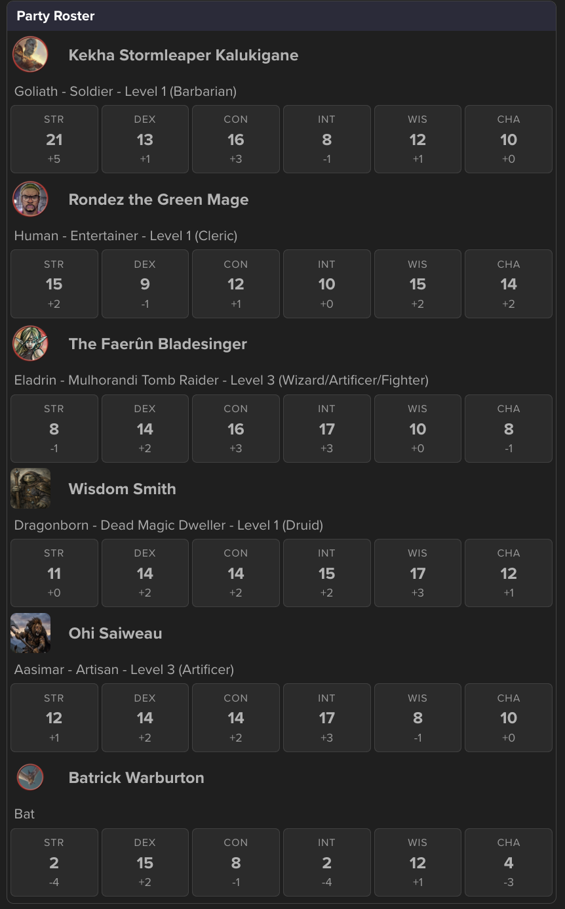
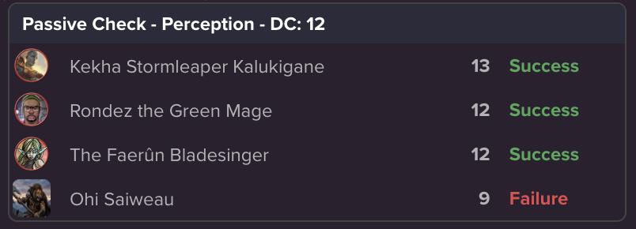
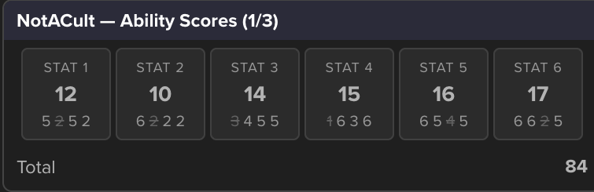
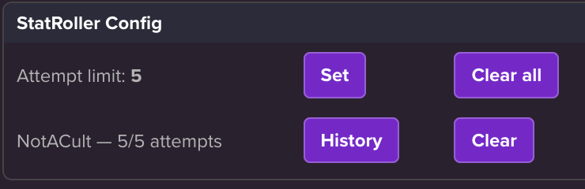

# roll20scripts

A collection of Roll20 API (Mod) scripts for game management. Paste the contents of a file into a new script in your game's **Mod (API) Scripts** page and save. All commands are chat commands; some operate on the currently selected token(s), others on the party.

> **Note:** API scripts require a Roll20 subscription tier that includes API access (Pro, or a game owned by a Pro user).

## Scripts at a glance

| Script | Command | Depends on |
|---|---|---|
| [chatCards.js](#chatcardsjs--chatcards) | *(library - no commands)* | - |
| [conditions.js](#conditionsjs--cond) | `!cond` | - |
| [hp.js](#hpjs--hp) | `!hp` | - |
| [partyman.js](#partymanjs--pm) | `!pm` | `chatCards.js` |
| [passiveCheck.js](#passivecheckjs--pcheck) | `!pcheck` | `chatCards.js`, `partyman.js` |
| [statRoller.js](#statrollerjs--rollstats) | `!rollstats` | `chatCards.js` |
| [whimsy.js](#whimsyjs--whimsy) | `!whimsy` | - |

Roll20 evaluates every script into one shared sandbox namespace, so the shared code is organized into IIFE namespaces (`ChatCards`, `PartyMan`, `PassiveCheck`, `StatRoller`).


---

## chatCards.js - `ChatCards`

A dependency-free library for the styled chat cards.

### `ChatCards.THEME`

| Key | Applies to |
|---|---|
| `card` | The outer card container |
| `header` | The title bar |
| `table` | The row table |
| `cell` | A default cell |
| `cellNum` | A right-aligned bold cell (scores, totals) |
| `avatarCell` / `avatar` | The narrow avatar cell and the `` in it (small, for data rows) |
| `avatarCellLg` / `avatarLg` | Larger avatar variant, for rows acting as section headers |
| `name` / `nameLg` | Name cell in the matching sizes (`nameLg` is bigger and bold) |
| `good` / `bad` | Semantic verdict cells - green/red bold (pass/fail, gain/loss) |
| `muted` | De-emphasized text - footnotes, and full-width detail rows like the roster's |
| `button` | Chat buttons (`<a>` styled as a button) |
| `tileRow`, `tile`, `tileLabel`, `tileValue`, `tileMod` | The stat-tile strip (see `Card.tiles`) |

Scripts building on ChatCards should use THEME keys instead of literal style strings when possible.

### `ChatCards.Card`

| Member | What it does |
|---|---|
| `new ChatCards.Card(title, [theme])` | Starts a card; pass a theme object to override the shared `THEME` |
| `.addRow(...cells)` | Appends a row - chainable |
| `ChatCards.Card.num(value)` | *(static)* Wraps a value as a right-aligned bold cell |
| `ChatCards.Card.span(content, span, [style])` | *(static)* Wraps content as a cell spanning `span` columns - for full-width rows inside a wider table |
| `ChatCards.Card.tiles(tiles, [theme])` | *(static)* Renders a strip of stat tiles: `[{label, value, sub?}]`, label over value over optional sub-line, equal widths |
| `ChatCards.Card.button(label, command, [theme])` | *(static)* Renders an API command button, entity-escaping `,` `\|` `}` so roll queries like `?{Attempts\|3}` survive the chat parser and prompt on click |
| `.render()` | Returns the card's HTML |
| `.whisperGM([from])` | Whispers the rendered card to the GM |
| `.send([from])` | Sends the rendered card to public chat |

A cell is either a plain value (`THEME.cell`) or an object `{ content, style, span? }`, where `style` is a THEME key such as `'cellNum'` or a raw CSS string.

### Example

```js
const card = new ChatCards.Card("Treasure Split")
card.addRow("Ohi Saiweau", ChatCards.Card.num("120 gp"))
    .addRow("Rondez the Green Mage", ChatCards.Card.num("120 gp"))
card.whisperGM("PartyFund")
```

A tile strip under a two-column row (this is how the Party Roster draws ability scores):

```js
card.addRow(ChatCards.Card.span(ChatCards.Card.tiles([
    { label: "STR", value: 16, sub: "+3" },
    { label: "DEX", value: 13, sub: "+1" },
    // ...
]), 2))
```

---

## conditions.js - `!cond`

A condition handler with access to the 2024 sheet status markers.

### Usage

Select one or more tokens, then:

| Command | Effect |
|---|---|
| `!cond +<marker>` | Add a status marker to the selected token(s) |
| `!cond -<marker>` | Remove a status marker from the selected token(s) |
| `!cond clear` | Remove **all** status markers from the selected token(s) |

`<marker>` is the marker's internal name (e.g. `sheet-blinded`, `red`, `dead`). Adding a marker that's already present is a no-op, as is removing one that isn't there. Feedback for errors (no tokens selected) is whispered to the GM.

### Examples

```
!cond +sheet-blinded
!cond -sheet-blinded
!cond clear
```

### Suggested macros

Create token-action macros for the conditions you use most:

```
Blind:      !cond +sheet-blinded
Unblind:    !cond -sheet-blinded
ClearCond:  !cond clear
```

This example uses the D&D 2024 sheet's marker set:

```
!cond ?{Condition|Blinded,+sheet-blinded|Charmed,+sheet-charmed|Deafened,+sheet-deafened|Exhausted,+sheet-exhausted|Frightened,+sheet-frightened|Grappled,+sheet-grappled|Incapacitated,+sheet-incapacitated|Invisible,+sheet-invisible|Paralyzed,+sheet-paralyzed|Petrified,+sheet-petrified|Poisoned,+sheet-poisoned|Prone,+sheet-prone|Restrained,+sheet-restrained|Stunned,+sheet-stunned|Unconscious,+sheet-unconscious|- CLEAR ALL -,clear}
```

---


## partyman.js - `!pm`

**PartyMan** - the party data layer. Other scripts (Passive Check, and anything else party-shaped) build on it.

PartyMan syncs every member's sheet data at sandbox start and caches it. Automated syncs are triggered when the party changes or manually. 

PartyMan offers a roster view of the party. Including familiars or other companions with the inParty flag. 



> **Requires:** `chatCards.js`.

### `PartyMan` namespace

#### The cached party

Any script that needs party data goes through the cache rather than building its own:

| Member | What it does |
|---|---|
| `getSyncedParty()` | *async* - the cached, sheet-synced `Party`, syncing on first use. **The safe default.** |
| `getCachedParty()` | *sync* - the cache, or `null` before the first sync completes |
| `refreshParty()` | *async* - re-sync from the sheets and replace the cache |
| `getParty()` | The raw character objects flagged `inParty: true` |
| `getMembers()` | Party characters wrapped as `Member`s - **unsynced**, so their caches are empty; use `getSyncedParty()` unless you specifically want that |

#### Classes

| Member | What it does |
|---|---|
| `Member` | Snapshot of one party character: `id`, `characterName`, `characterSheet`, `controlledBy`, `avatar`, `defaultToken`, plus the three sheet caches (`abilityScores`, `skills`, `details`) and `syncSheet()`, which loads all of them concurrently |
| `MemberAbilityScores` | The six scores; `getAbilityMod()` / `getAbilityModText()` derive modifiers locally, `abilityScoreCells(span)` renders the tile strip |
| `MemberSkills` | All 18 skill bonuses; `getMod()`, `getModText()`, and `getPassive()` (which adds `PASSIVE_BASE`) |
| `MemberDetails` | Race, background, level, classes; `summaryText()` renders the roster's detail line, `detailCells(span)` returns it as a cell - or `null` when the sheet supplied nothing |
| `Party` | The member collection; `syncParty()` refreshes the list and loads every member's sheet data concurrently across the whole party, `getMember(charId)` finds one |

#### Shared vocabulary

| Member | What it does |
|---|---|
| `SKILLS` | The 18 skills as the 2024 sheet names them |
| `PASSIVE_BASE` | The 10 in `passive = 10 + bonus` |
| `normalizeSkill()` / `isSkill()` / `skillDisplayName()` | User input → a `SKILLS` entry; validation; `'sleight_of_hand'` → `'Sleight of Hand'` |
| `modText(5)` | `'+5'` |
| `NO_VALUE` | The `-` placeholder for anything the sheet couldn't supply |
| `memberCells(member, [size])` | Avatar + name cells for a `ChatCards.Card` row - `'sm'` (default) for dense data rows, `'lg'` for section-header rows like the roster |

```js
const card = new ChatCards.Card("Passive Check - Insight")
for (const member of (await PartyMan.getSyncedParty()).members) {
    card.addRow(...PartyMan.memberCells(member), ChatCards.Card.num(member.skills.getPassive('insight')))
}
card.whisperGM("Passive Check")
```

#### Cache freshness

A debounced `change:character` listener keeps the cache self-healing for membership changes and edits to the character object itself. Most sheet data changes won't cause a sync. Calling `!pm refresh` will force an update.

### Usage

| Command | Effect |
|---|---|
| `!pm party` | Post the Party Roster card (from the startup cache) |
| `!pm refresh` | Force a re-sync - needed after sheet edits, which fire no event the cache can hear |

No token selection required - membership comes from the characters' `inParty` flag. On sandbox start PartyMan posts a *PartyMan Ready* card with the synced member count and a Display Party button; because the card is sent **after** the sync resolves, its appearance is the readiness signal.

### Suggested macros

```
Party:        !pm party
PartyRefresh: !pm refresh
```

Or just click the button PartyMan posts to chat when the sandbox spins up.

---

## passiveCheck.js - `!pcheck`

**Passive Check** - reports the party's passive score for **D&D 2024 skills** and whispers the results to the GM as a card. No token selection needed - the party comes from PartyMan - so it's ideal for quietly checking whether anyone notices the ambush, or for a group passive Stealth against the guards' passive Perception.

Scores are read from **PartyMan's cachet**, so a check lands instantly. 

Pass an optional DC to get a Success/Failure per member. Without a DC you get the raw scores.




> **Requires:** `chatCards.js` and `partyman.js` (which supplies both the party and the skill vocabulary).

### Usage

| Command | Effect |
|---|---|
| `!pcheck <skill>` | Whisper each party member's passive score for that skill to the GM |
| `!pcheck <skill> <dc>` | Same, plus Success/Failure per member vs the DC (e.g. `!pcheck insight 12`) |
| `!pcheck help` | Whisper the help card back to whoever asked |

`<skill>` is any of the 18 skills:

```
acrobatics        deception       intimidation    nature          religion
animal handling   history         investigation   perception      sleight of hand
arcana            insight         medicine        performance     stealth
athletics                                                         survival
```

Skill names are normalized e.g. - `Sleight of Hand`, `sleight_of_hand`, and `sleight-of-hand` are treated the same. Multi-word skills parse correctly alongside a DC (`!pcheck sleight of hand 12`).

### Examples

```
!pcheck perception
!pcheck insight 12
!pcheck sleight of hand 15
```

### Suggested macros

All 18 skills in one prompted macro:

```
Passives: !pcheck ?{Check Type|Acrobatics, acrobatics|Animal Handling, animal_handling|Arcana, arcana|Athletics, athletics|Deception, deception|History, history|Insight, insight|Intimidation, intimidation|Investigation, investigation|Medicine, medicine|Nature, nature|Perception, perception|Performance, performance|Persuasion, persuasion|Religion, religion|Sleight of Hand, sleight_of_hand|Stealth, stealth|Survival, survival} ?{DC}
```

Enter a number at the DC prompt for pass/fail; leaving it blank falls back to the raw-score card (possibly with an "Invalid DC" nudge, depending on how chat trims the blank).

The most common skills:

```
Passives: !pcheck ?{Check Type|Perception, perception|Insight, insight|Investigation, investigation} ?{DC}
```
---

## statRoller.js - `!rollstats`

Rolls ability score arrays using the **4d6 drop lowest** method and posts each one as a ChatCards tile strip. Every array is stored in persistent `state` per player, which powers attempt limits, history, and a GM config menu.



> **Requires:** `chatCards.js`.

### Usage

| Command | Effect |
|---|---|
| `!rollstats` | Roll one array (counts against the attempt limit) |
| `!rollstats <n>` | Roll `n` arrays, one card each, clamped to attempts remaining |
| `!rollstats history` | Whisper your stored arrays back to you |

Each card's title carries an attempt stamp - `Alice - Ability Scores (2/3)` - so every posted array shows which attempt it was. When a request exceeds the attempts left, the script rolls what it can only. At the limit, further rolls are refused. Default limit is 3; `0` means unlimited.

### GM commands

| Command | Effect |
|---|---|
| `!rollstats menu` | Whispered config card: current limit with a Set button, then one row per player with rolls - attempts used, History and Clear buttons |
| `!rollstats limit <n>` | Set the attempt limit (0 = unlimited) |
| `!rollstats history <playerid>` | Whisper any player's stored arrays to you |
| `!rollstats clear <playerid>` | Rebirth - wipe that player's count **and** history |
| `!rollstats clearall` | Wipe everyone; the new-campaign button |



All GM commands are guarded with `playerIsGM(playerid)`. Players are keyed by `playerid`.

### Suggested macros

```
RollStats:  !rollstats
RollStats3: !rollstats 3
StatConfig: !rollstats menu
```

`RollStats` rolls are intended to be visible to all players.

---

## whimsy.js - `!whimsy`

**WhimsyName** - prefixes selected tokens with a unique random adjective drawn from a ~1300 word corpus. 

Adjectives are never removed from the pool after use until reset. Guaranteeing unique names for your monsters.

### Usage

| Command | Effect |
|---|---|
| `!whimsy` | Prefix each selected token with a unique adjective (or reroll it) |
| `!whimsy sheet` | Explicit synonym for the default - exists for macros, since Roll20 roll queries can't reliably produce an empty dropdown value |
| `!whimsy token` | Same, but base the name on the token's nameplate instead of the sheet |
| `!whimsy reset` | Return all adjectives to the pool |
| `!whimsy count` | Whisper to the GM how many adjectives remain |

> **Disguise caveat:** the default path reads the *sheet* name. A token deliberately nameplated differently from its character should use `!whimsy token` to avoid spoilers.

### Examples

Select a group of freshly dropped monster tokens, then:

```
!whimsy
```

Simply select a token and run `!whimsy` to reroll its name.

### Suggested macros

```
Whimsy:      !whimsy ?{Name from|Sheet,sheet|Token,token}
WhimsyReset: !whimsy reset
WhimsyCount: !whimsy count
```

`Whimsy` works well as a token action so you can name mobs the moment you place them. 

---

## Installation

1. In your Roll20 game (as the creator, with API access), go to **Settings → Mod (API) Scripts**.
2. Click **New Script**, name it after the file (e.g. `whimsy.js`), and paste the file's contents.
3. **Save Script**. The sandbox restarts and the command is live in chat.
4. Repeat for any script the one you want depends on - see the dependency column in [Scripts at a glance](#scripts-at-a-glance).
